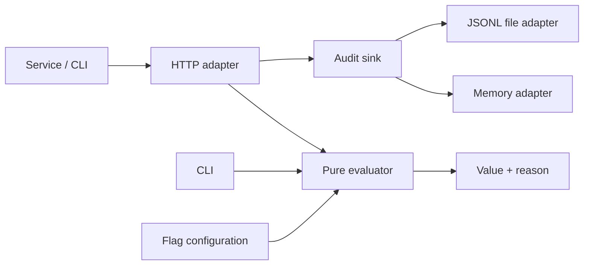

# Relay Flags

Relay Flags is a deterministic feature-flag evaluator for backend services. It keeps decision logic in-process and explicit so services can make fast, inspectable flag decisions without a network dependency during request handling.

It supports typed boolean and string-variant flags, ordered rules, reusable segments, percentage rollouts, deterministic subject bucketing, defaults, structured reasons, and append-only audit records.



## Quick Start

Requires Node.js 20 or later.

```sh
npm install
npm run build
npm start
```

The server starts on port `3000`, reads `examples/flags.json`, and appends evaluation records to `audit.jsonl`. Set `PORT`, `FLAG_CONFIG`, or `AUDIT_LOG` to change these.

Evaluate a fixture directly:

```sh
npm run cli -- examples/flags.json examples/subject.json search-algorithm
```

## HTTP API

`GET /health`

```json
{"status":"ok"}
```

`POST /v1/evaluate`

```sh
curl -X POST http://localhost:3000/v1/evaluate \
  -H 'content-type: application/json' \
  -d '{"flagKey":"new-checkout","subject":{"key":"user-123","attributes":{"plan":"pro"}}}'
```

Example response:

```json
{"flagKey":"new-checkout","value":true,"reason":{"kind":"ROLLOUT","bucket":17}}
```

`POST /v1/evaluate/batch` accepts an `evaluations` array containing the same objects accepted by the single endpoint:

```json
{"evaluations":[{"flagKey":"new-checkout","subject":{"key":"user-1"}}]}
```

Invalid JSON, invalid request bodies, and unknown flags return a JSON `400` response with an `error` and `message`. Invalid flag configuration prevents the server from starting. Unknown routes return 404.

## Evaluation Model

Evaluation is pure: `evaluateFlag(config, flagKey, subject)` neither reads nor writes anything. For a flag, Relay Flags evaluates rules in listed order and returns the first match. A rule can contain AND-ed attribute clauses or refer to a reusable segment. When no rule matches, a rollout hashes `flagKey:salt:subjectKey` with SHA-256 and maps the first 32 bits into one of 100 buckets. Weighted variations consume contiguous bucket ranges. If no rollout is configured, the typed flag default is returned.

The hash makes assignments stable for a fixed key and salt, while changing either intentionally reshuffles the population. A 100-bucket model makes configuration simple and explainable, at the cost of percentage precision below one percent. Configuration is validated before each evaluation for defensive clarity; a long-lived, high-throughput embedding can validate once and retain its immutable configuration instead.

Audit output is deliberately outside the evaluator. The HTTP adapter emits a timestamped event after a successful result through an `AuditSink`; `JsonlFileAuditSink` serializes one append-only JSON object per line. File audit writing is appropriate for local use, not a replacement for durable, centralized production event delivery.

## Configuration

See [examples/flags.json](examples/flags.json). Subjects have a required string `key` and optional primitive-valued `attributes`. Clauses use `equals` or `in`; both compare strictly. A boolean flag can only have boolean rule and rollout values, and a string flag can only have string values. Rollout weights must be positive integers totaling 100.

## Development

```sh
npm test          # builds then runs Node's native test runner
npm run typecheck # TypeScript strict-mode check
npm run build     # compile to dist/
```

Build and run the container locally:

```sh
docker build -t relay-flags .
docker run -p 3000:3000 relay-flags
```

## Project Structure

```text
src/evaluator.ts  Pure validation, matching, rollout, and evaluation
src/http.ts       Native Node HTTP adapter and input validation
src/audit.ts      AuditSink seam plus memory and JSONL adapters
src/cli.ts        Configuration/subject fixture command
src/server.ts     Local server entry point
test/             Native Node test runner suite
examples/         Runnable flag and subject fixtures
```

## Intentionally Out Of Scope

This repository intentionally does not include a configuration control plane, flag authoring UI, remote configuration fetch, authentication/authorization, tenant isolation, SDKs for other languages, streaming updates, cryptographic signing, metrics export, distributed audit delivery, or persistence beyond the local JSONL adapter.

## Future Improvements

- Precompile validated configurations for high-throughput embeddings.
- Add richer clause operators and explicit rule-level rollouts.
- Add request IDs and asynchronous, durable audit adapters.
- Add OpenAPI documentation and authenticated multi-tenant endpoints.
